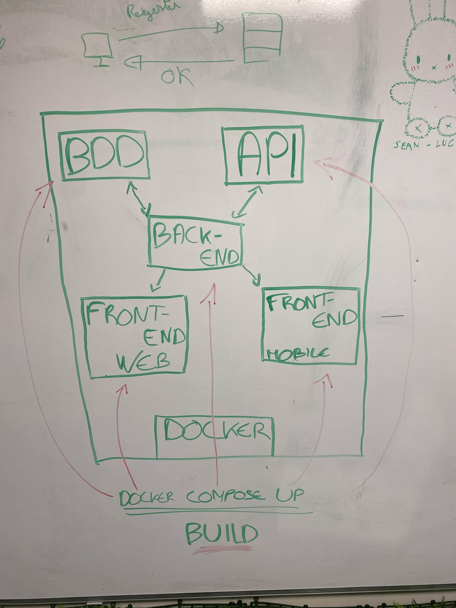

# Architecture du Projet AREA

Le projet AREA repose sur une architecture modulaire et distribuée où chaque composant communique avec les autres à travers des APIs et des services bien définis. Voici un aperçu des différentes couches et de leur interaction.

## 1. Base de Données (BDD)
La base de données utilisée pour ce projet est **PostgreSQL**. Elle est responsable de la gestion des données de l'application, y compris les informations des utilisateurs, les événements, et d'autres données liées aux services et actions. La communication avec la base de données se fait via le **Backend**, qui interagit avec PostgreSQL en envoyant des requêtes et en récupérant les données nécessaires pour le bon fonctionnement de l'application.
Pour voir comment va être la BDD référez vous à [ce fichier](../BDD/Explication-BDD.md)

## 2. Backend (Express.js)
Le backend de notre application est construit avec **Express.js**. Il agit comme un intermédiaire entre le frontend (Web et Mobile), la base de données, et les API externes. Le backend est responsable de :
- Gérer les requêtes HTTP provenant du **Frontend** (Web et Mobile),
- Interagir avec la **Base de Données** pour récupérer et stocker les informations,
- Communiquer avec les **API externes** (par exemple, Google, Outlook, OneDrive) pour exécuter des actions et des réactions en fonction des besoins de l'utilisateur.

Le backend utilise **OAuth2** pour l'authentification des utilisateurs et pour la communication sécurisée avec les services externes.

## 3. Frontend (Web et Mobile)
Le frontend est composé de deux parties distinctes :
- **Frontend Web** : Développé avec **Next.js**, il permet à l'utilisateur d'interagir avec l'application via un navigateur. Il envoie des requêtes au backend pour récupérer ou envoyer des données.
- **Frontend Mobile** : Développé avec **React Native**, il offre une expérience utilisateur similaire à celle de l'application Web, mais sur des appareils mobiles. Il interagit également avec le backend via des API RESTful.

Les deux frontends (Web et Mobile) consomment les mêmes API exposées par le backend pour assurer une expérience cohérente sur toutes les plateformes.

## 4. APIs Externes
Le backend est conçu pour se connecter à plusieurs **APIs externes** (Google, Outlook, OneDrive, etc.). Ces services sont utilisés pour offrir des fonctionnalités comme la gestion de calendriers, la gestion de fichiers, et bien plus encore. Le backend agit comme un client de ces services et gère les actions et réactions en fonction des interactions de l'utilisateur.

## 5. Conteneurisation avec Docker
L'ensemble du projet est conteneurisé à l'aide de **Docker**. Chaque composant (Base de Données, Backend, Frontend Web, Frontend Mobile, etc.) est défini comme un service dans un fichier **docker-compose.yml**. Cela permet de garantir que l'application fonctionne de manière cohérente sur tous les environnements, qu'il s'agisse de développement local ou de production.

## 6. Orchestration avec Docker Compose
L'orchestration des services se fait grâce à la commande suivante :
```bash
docker-compose up
```
Cette commande permet de lancer l'ensemble des services dans des conteneurs Docker. Elle assure également la mise en réseau entre les conteneurs et gère les dépendances entre les différents services (par exemple, s'assurer que la base de données est prête avant de démarrer le backend).

## Conclusion
L'architecture du projet AREA repose sur une communication fluide entre les différents composants : la Base de Données, le Backend, les APIs externes, et les Frontends Web et Mobile. Tout cela est orchestré à l'aide de Docker et Docker Compose, garantissant une gestion efficace des dépendances et une facilité de déploiement.

**Voici un schéma de l'architecture**

